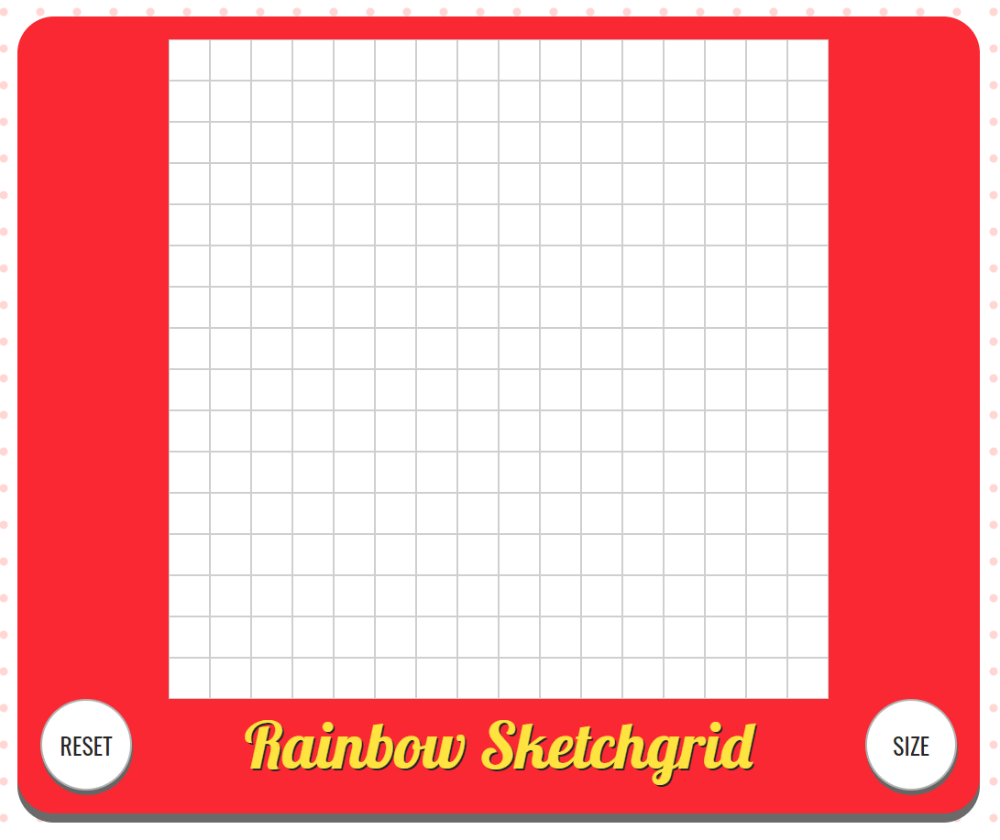

# Rainbow Sketchgrid

## Overview
An interactive webpage where you can mouse over an unfilled grid of squares and colour them in with a shifting hue.

The grid size may be freely chosen from a 1 by 1 to 100 by 100, and the current sketch can be reset any time.

This project was completed as part of [The Odin Project](https://github.com/TheOdinProject/curriculum)'s curriculum.

## Usage
The page is hosted on **GitHub Pages** and can be accessed [here](https://willkip.github.io/rainbow-sketchgrid/).

The page initializes a 16 by 16 grid you can fill. The hue of the colour tiles are filled with is incremented with every tile, so the end result is a 'rainbow' effect appearing in the lines drawn.

The *Reset* button may be pressed at any time to wipe the board to its initial state, and the *Size* button will let you set the grid size anywhere from 1 by 1 to 100 by 100. Changing the grid size will reset the current board, even if the same grid size is chosen. Pressing cancel in the prompt will not cause a reset.

Here is the whole app in action:

## Summary and Outcomes

This was my first experience using **JavaScript** alongside **HTML** and **CSS**, giving life to the website with DOM manipulation.

- I created and added a **Favicon** for the website, and **imported external fonts**.
- I used **JavaScript functions** to organize my code and minimize reiteration.
- I used **EventListeners** to check for *mouseover* events so that tiles could be filled in interactively.
- I used **CSS Grid** to position and align the tiles of the Sketchgrid.
    - In addition, I used the **CSS calc()** function alongside variables to calculate values for the Grid.
### Improvement
- The prompt to change size appears over the grid, which when an option is selected with the mouse, the mouse will be hovering directly above the grid as the prompt will disappear beneath it. This will cause unwanted drawing.
    - Possible solutions include an alternative location and method to input a new size, or making the app require an extra click to focus inside and become interactable.
- There is no scaling in place. Smaller versions of the app could be made available with smaller window sizes.
- An option to toggle or change the colour of the tiles filling in would be a good feature to implement.
- The app lags with too many tiles; possibly the JavaScript could be optimized with use of **Objects**.

## Acknowledgements
Eric Meyer's [CSS Reset](https://meyerweb.com/eric/tools/css/reset/) was used to standardize the viewing experience cross-browser.

The Oswald and Lobster fonts were imported from [Google Fonts](https://fonts.google.com/icons).

## License
This project is licensed under [MIT](https://choosealicense.com/licenses/mit/).